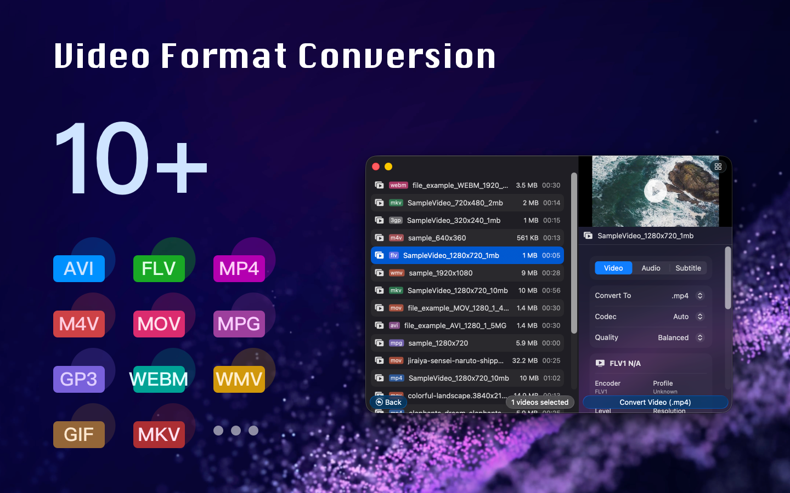
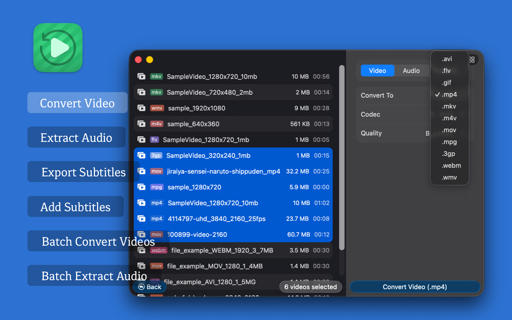
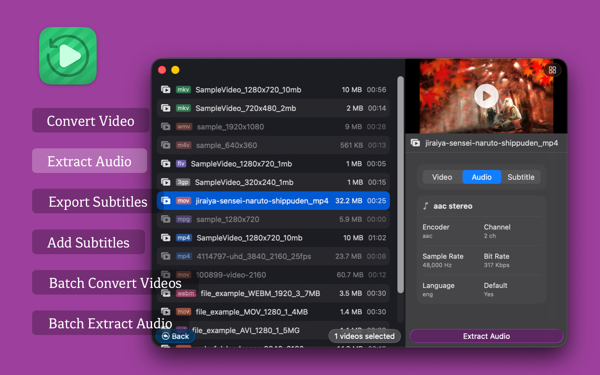
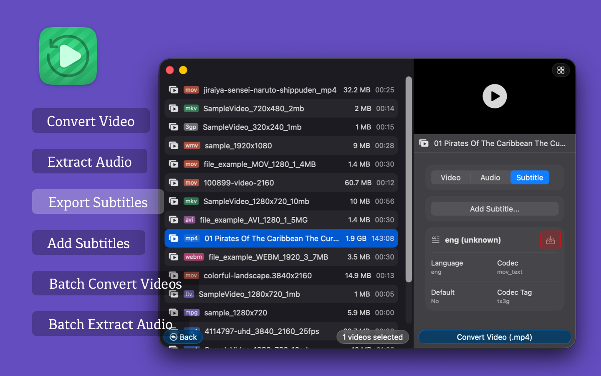

<!--idoc:ignore:start-->
> [!TIP]
> Declaration: This project is not an open-source project. The repository serves as the official website, used to collect issues and user demands. This is done to save costs, because without an official website, the application cannot pass the review.
<!--idoc:ignore:end-->

   
   
  
  <h1>
    Videoer
  </h1>
  
<strong>Video converter for macOS with batch conversion, audio extraction, and subtitle tools.</strong>

  <!--rehype:style=border: 0;-->
  

    <a href="./README.zh.md">简体中文</a> • 
    <a target="_blank" href="https://github.com/jaywcjlove/videoer/issues/new?template=bug_report.yml">Contact & Support</a> • 
    <a href="https://github.com/jaywcjlove/videoer/releases">Changelog</a>
  

  

    
  

## What Is Videoer?

Videoer is a video converter app for macOS. It helps you convert video formats, extract audio, export subtitles, and add subtitles to videos from one desktop tool. If you need a simple Mac app for converting MP4, MKV, MOV, WEBM, AVI, GIF, 3GP, FLV, or MPG files, Videoer is built for that workflow.

## Why Use Videoer?

- Convert videos between common formats on macOS.
- Batch process multiple files to save time.
- Extract audio from video into popular audio formats.
- Export subtitle tracks from video files.
- Add subtitle files to videos for playback or sharing.
- Handle large video files, including files larger than 1GB.

## Features

- Video Conversion: Convert between MP4, MKV, M4V, MOV, WEBM, AVI, GIF, 3GP, FLV, MPG, and other common video formats.
- Audio Extraction: Export audio to MP3, AAC, WAV, FLAC, ALAC, OGG, OPUS, AC3, EAC3, DTS, and TrueHD.
- Subtitle Export: Extract embedded or external subtitles such as SRT, ASS, and VTT.
- Add Subtitles: Merge subtitle files into videos to improve accessibility and viewing.
- Batch Video Conversion: Convert multiple video files at the same time.
- Large File Support: Convert videos larger than 1GB while preserving output quality.
- Batch Audio Extraction: Extract audio from multiple videos in one run.

## Supported Formats

### Supported video formats

MP4, MKV, M4V, MOV, WEBM, AVI, GIF, 3GP, FLV, MPG

### Supported audio export formats

MP3, AAC, WAV, FLAC, ALAC, OGG, OPUS, AC3, EAC3, DTS, TrueHD

### Supported subtitle formats

SRT, ASS, VTT

## Who Is It For?

Videoer is useful for:

- Content creators who need fast format conversion before publishing.
- Video editors who need audio extraction or subtitle handling.
- Mac users who want a lightweight desktop video converter.
- Teams or individuals who often process multiple video files in batches.

## Common Use Cases

- Convert MKV to MP4 for easier playback and sharing.
- Extract audio from video for podcasts, clips, or archiving.
- Export subtitle tracks from downloaded or recorded videos.
- Add subtitles to videos for tutorials, demos, or social media uploads.
- Batch convert large video files on macOS.

## FAQ

### What does Videoer do?

Videoer converts video files, extracts audio, exports subtitles, and adds subtitles on macOS.

### Can Videoer batch convert videos?

Yes. Videoer supports batch video conversion and batch audio extraction.

### Can Videoer convert large video files?

Yes. Videoer supports videos larger than 1GB.

### Which subtitle formats does Videoer support?

Videoer supports common subtitle formats including SRT, ASS, and VTT.

### Is Videoer for macOS?

Yes. Videoer is designed for macOS and is available on the Mac App Store.
