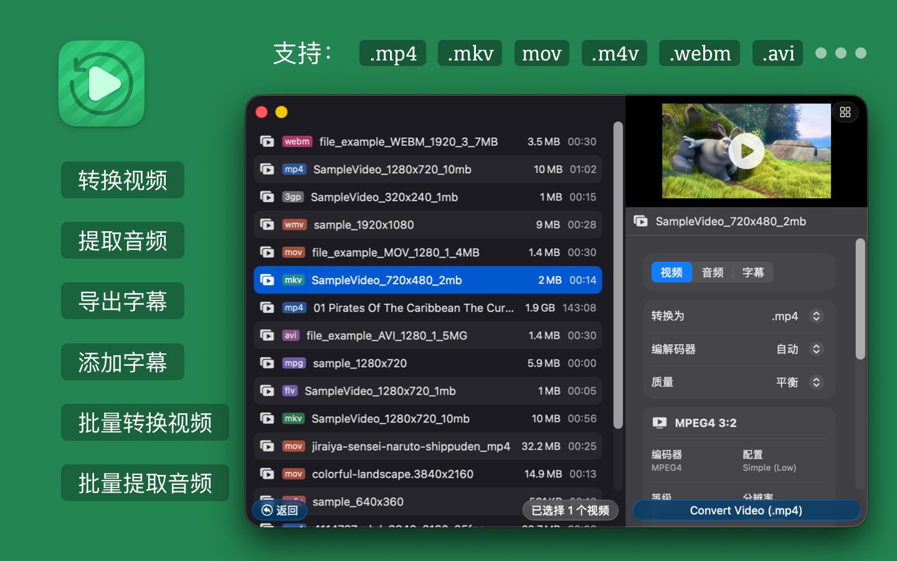
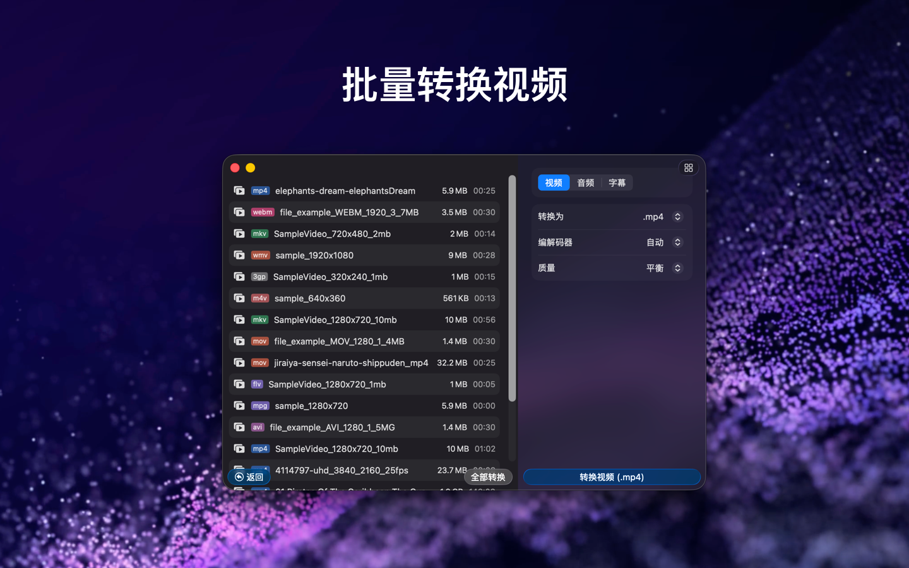
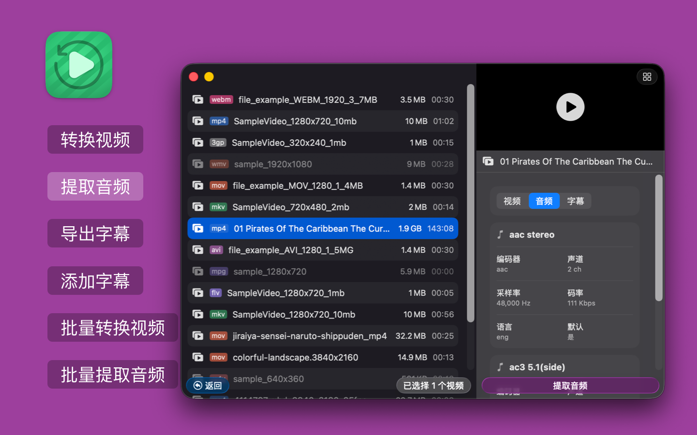
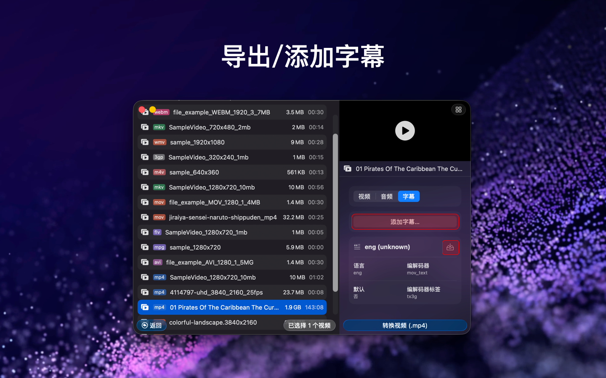

<!--idoc:ignore:start-->
> [!TIP]
> 声明：此项目并非开源项目，仓库作为官方网站，用于收集问题和用户需求。这样做是为了节省成本，因为没有官网，应用无法通过审核。
<!--idoc:ignore:end-->

   
   
  
  <h1>
    Videoer
  </h1>
  
<strong>适用于 macOS 的视频格式转换工具，支持批量转换、音频提取和字幕处理。</strong>

  <!--rehype:style=border: 0;-->
  

    <a href="./README.md">English</a> • 
    <a target="_blank" href="https://github.com/jaywcjlove/videoer/issues/new?template=bug_report_cn.yml">联系&支持</a> • 
    <a href="https://github.com/jaywcjlove/videoer/releases">变更日志</a>
  

  

    
  

## Videoer 是什么？

Videoer 是一款适用于 macOS 的视频格式转换应用，支持视频转码、音频提取、字幕导出和字幕添加。如果你想在 Mac 上快速完成 MP4、MKV、MOV、WEBM、AVI、GIF、3GP、FLV、MPG 等格式转换，Videoer 可以直接满足这类需求。

## 为什么选择 Videoer？

- 在 macOS 上转换常见视频格式。
- 支持批量处理多个视频文件，提高效率。
- 支持从视频中提取音频并导出为常用音频格式。
- 支持导出视频中的字幕轨道。
- 支持为视频添加字幕文件。
- 支持处理大体积视频文件，包括大于 1GB 的视频。

## 主要功能

- 视频转换：支持 MP4、MKV、M4V、MOV、WEBM、AVI、GIF、3GP、FLV、MPG 等主流视频格式互转。
- 音频提取：可导出为 MP3、AAC、WAV、FLAC、ALAC、OGG、OPUS、AC3、EAC3、DTS、TrueHD 等格式。
- 字幕导出：支持提取内嵌或外挂字幕，如 SRT、ASS、VTT。
- 添加字幕：可将字幕文件添加到视频中，提升可访问性与观看体验。
- 批量转换：支持同时转换多个视频文件。
- 大文件支持：可处理大于 1GB 的视频文件，并尽量保证输出质量。
- 批量提取音频：支持一次性从多个视频中提取音频。

## 支持的格式

### 支持的视频格式

MP4、MKV、M4V、MOV、WEBM、AVI、GIF、3GP、FLV、MPG

### 支持的音频导出格式

MP3、AAC、WAV、FLAC、ALAC、OGG、OPUS、AC3、EAC3、DTS、TrueHD

### 支持的字幕格式

SRT、ASS、VTT

## 适合哪些用户？

Videoer 适合：

- 需要快速转换视频格式的内容创作者。
- 需要提取音频或处理字幕的视频编辑用户。
- 想在 Mac 上使用轻量级视频转换工具的普通用户。
- 经常需要批量处理视频文件的个人或团队。

## 常见使用场景

- 将 MKV 转换为 MP4，方便播放、分享或上传。
- 从视频中提取音频，用于剪辑、归档或二次创作。
- 导出视频内的字幕轨道，便于整理和复用。
- 为教程、演示或社交媒体视频添加字幕。
- 在 macOS 上批量转换大体积视频文件。

## 常见问题

### Videoer 可以做什么？

Videoer 可以在 macOS 上完成视频格式转换、音频提取、字幕导出和字幕添加。

### Videoer 支持批量转换吗？

支持。Videoer 可以批量转换视频，也支持批量提取音频。

### Videoer 可以处理大文件吗？

支持。Videoer 支持处理大于 1GB 的视频文件。

### Videoer 支持哪些字幕格式？

Videoer 支持常见字幕格式，包括 SRT、ASS 和 VTT。

### Videoer 是 macOS 应用吗？

是。Videoer 面向 macOS，并已上架 Mac App Store。

<!--version: v1.0.0-->
